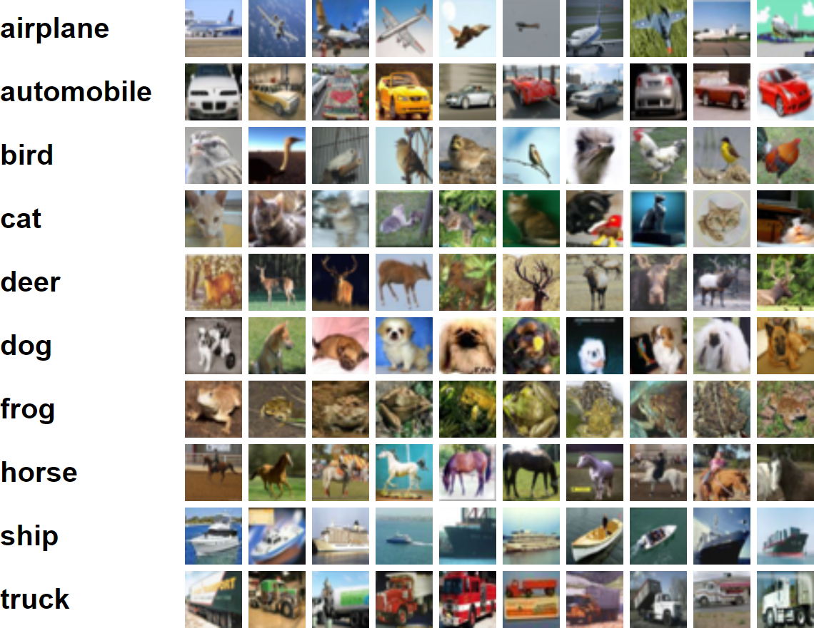

# argon

Computer vision object classifier for Android using the [cobalt neural network](https://github.com/cnvx/cobalt).

## About

This app is capable of recognising 10 types of objects (taken from the [CIFAR-10 data set](https://www.cs.toronto.edu/~kriz/cifar.html)):

It would be relatively easy to retrain the neural network with more object classes, provided you have enough training data.

## Install

### Just the app

Simply download and install [this APK](https://github.com/cnvx/argon/raw/master/argon.apk).

### Build it yourself

Clone or download this repository and perform a Gradle sync, this can be done from Android Studio:
1. Build -> Make Project
2. File -> Sync Project with Gradle Files

Now you should be able to build and run the app.

## License

This app uses the [MIT License](LICENSE).  
Code belonging to the Android Open Source Project is released under the [Apache License, Version 2.0](http://www.apache.org/licenses/LICENSE-2.0).
